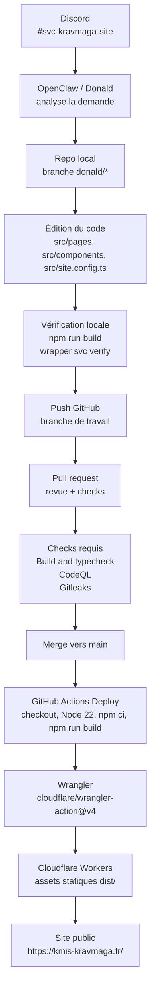

# Site web - Krav Maga Instinctive System

Site statique Astro pour l’association Krav Maga Instinctive System à
Limeil-Brévannes.

- Site public : https://kmis-kravmaga.fr/
- Dépôt GitHub : https://github.com/khoaowen/kravmaga-instinctive-system-site
- Plateforme de déploiement : Cloudflare Workers avec static assets via Wrangler
- Canal de pilotage opérationnel : Discord `#svc-kravmaga-site`

## État actuel du site

Le site publie les pages principales de l’association :

- Accueil : présentation KMIS, discipline, appels à l’essai et instructeur
- Cours de Krav Maga à Limeil-Brévannes
- Horaires et tarifs : cours lundi et jeudi 20:30-22:00, tarifs saison 2025/2026
- Lieu : informations pratiques et accès
- Instructeurs
- Inscription / essai
- Actualités
- FAQ
- Mentions légales et confidentialité

Le site évite volontairement les formulaires pour limiter la collecte de données.
Le contact passe par WhatsApp, téléphone, email ou liens externes contrôlés.

Tarifs publiés pour la saison 2025/2026 :

- Adulte : 254 EUR
- Famille adulte, 2ème adulte : 139 EUR
- Étudiant / demandeur d’emploi : 219 EUR

## Stack technique

- Astro 6
- TypeScript
- `@astrojs/check` pour la vérification TypeScript/Astro
- `@astrojs/sitemap` pour le sitemap
- GitHub Actions pour CI, analyse et déploiement
- Cloudflare Workers pour l’hébergement des assets statiques générés dans `dist/`

## Installation locale

Pré-requis :

- Node.js 22.12 ou plus récent
- Git
- Accès au dépôt GitHub

Commandes :

```bash
npm ci
npm run dev
```

Le site sera visible en local sur l’adresse indiquée par Astro, souvent
`http://localhost:4321`.

## Scripts utiles

```bash
npm run dev      # serveur local Astro
npm run build    # astro check puis astro build
npm run preview  # preview locale du build
```

Le site généré est écrit dans :

```text
dist/
```

Dans l’environnement OpenClaw/Donald, la vérification de service passe aussi par
le wrapper workspace :

```bash
/home/openclaw/.openclaw/workspace/scripts/bin/svc-kravmaga-site verify
```

## Modifier le contenu

Les informations transverses sont centralisées autant que possible dans :

```text
src/site.config.ts
```

Exemples d’informations à modifier ici :

- Adresse
- Téléphone
- Email
- Horaires
- Tarifs
- Liens Facebook, Instagram et HelloAsso
- Lien Google Maps
- Texte et checklists du cours d’essai
- Métadonnées des photos publiées

Les pages sont dans :

```text
src/pages/
```

Les images publiques sont dans :

```text
public/images/
```

Avant d’ajouter une photo, vérifier les droits de publication et le consentement
des personnes visibles.

## Domaine et SEO

Le domaine canonique est configuré dans :

```text
astro.config.mjs
```

La configuration actuelle utilise :

```js
site: "https://kmis-kravmaga.fr"
```

Le fichier `public/robots.txt` référence aussi le domaine et le sitemap.

## Workflow depuis Discord jusqu’au déploiement

Le fonctionnement actuel est basé sur un flux PR court : Khoa demande une
modification dans Discord, Donald implémente dans une branche, ouvre une PR, les
contrôles GitHub passent, puis la fusion sur `main` déclenche le déploiement
Cloudflare. Les secrets restent dans GitHub Actions / Cloudflare et ne
transitent pas par Discord.



Vue logique :

```mermaid
flowchart LR
    Discord["Discord service channel"] --> OpenClaw["OpenClaw agent"]
    OpenClaw --> LocalRepo["Local Git branch"]
    LocalRepo --> GitHubPR["GitHub pull request"]
    GitHubPR --> ProtectedMain["Protected main branch"]
    ProtectedMain --> Actions["GitHub Actions Deploy"]
    Actions --> Cloudflare["Cloudflare Workers"]
    Cloudflare --> Website["kmis-kravmaga.fr"]
```



## Règles GitHub

Le flux normal passe par une pull request.

Checks requis sur `main` :

- `Build and typecheck`
- `Analyze JavaScript and TypeScript`
- `Gitleaks`

Le déploiement Cloudflare historique géré directement par le dashboard
Cloudflare n’est plus un check requis. Le déploiement de référence est le
workflow GitHub Actions `Deploy`.

Les modifications de fichiers sous `.github/workflows/` nécessitent un token
GitHub ou une GitHub App avec la permission Workflows. Les modifications de
contenu du site passent ensuite par le flux PR normal.

## Déploiement Cloudflare

Le déploiement se fait automatiquement à chaque push sur `main` via :

```text
.github/workflows/deploy.yml
```

Le workflow fait :

1. Checkout du dépôt
2. Installation de Node.js 22
3. `npm ci`
4. `npm run build`
5. `cloudflare/wrangler-action@v4` avec `wrangler deploy`

Wrangler lit :

```text
wrangler.jsonc
```

La configuration actuelle déploie les assets statiques de `./dist/` sur le
Worker :

```text
kravmaga-instinctive-system-site
```

Secrets GitHub Actions requis :

```text
CLOUDFLARE_API_TOKEN
CLOUDFLARE_ACCOUNT_ID
```

Ces secrets doivent rester uniquement dans GitHub Actions / Cloudflare. Ne pas
les committer et ne pas les coller dans Discord.

## Runbook de maintenance

Les mises à jour récurrentes sont documentées dans :

```text
docs/UPDATE-RUNBOOK.md
```

Le runbook couvre rentrée, stage, horaires, tarifs, photos, contact et
vérifications avant PR.

Le parcours d’inscription en ligne est préparé dans `/inscription/`. La solution
cible est documentée dans `docs/INSCRIPTION.md` : Tally pour le formulaire,
Google Sheets / Drive pour le stockage, et `contact@kmis-kravmaga.fr` seulement
pour les notifications.

## Sécurité et données

- Ne pas stocker de listes d’adhérents, données de santé, exports de paiement ou
  conversations privées dans le dépôt.
- Ne pas ajouter de formulaire sans revue explicite de la collecte et du RGPD.
- Garder les credentials dans GitHub Actions secrets ou Cloudflare.
- Vérifier les diffs avant push pour éviter secrets, documents personnels ou
  informations internes non publiées.
